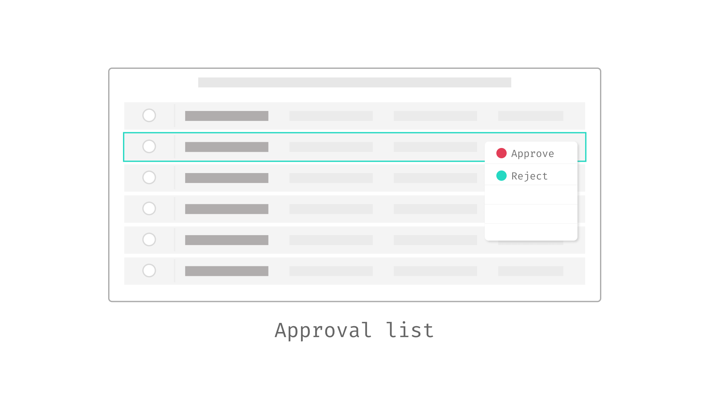

# Data Fetching Patterns in Frontend Applications

Today, most applications can send hundreds of requests for a single page. For example, my Twitter home page sends around 300 requests, and an Amazon product details page sends around 600 requests. Some of them are for static assets (JavaScript, CSS, font files, icons, etc.), but there are still around 100 requests for async data fetching - either for timelines, friends, or product recommendations, as well as analytics events. That’s quite a lot.

The main reason a page may contain so many requests is to improve performance and user experience, specifically to make the application *feel* faster to the end users. The era of blank pages taking 5 seconds to load is long gone. In modern web applications, users typically see a basic page with style and other elements in less than a second, with additional pieces loading progressively.

Take the Amazon product detail page as an example. The navigation and top bar appear almost immediately, followed by the product images, brief, and descriptions. Then, as you scroll, "Sponsored" content, ratings, recommendations, view histories, and more appear.Often, a user only wants a quick glance or to compare products (and check availability), making sections like "Customers who bought this item also bought" less critical and suitable for loading via separate requests.

Breaking down the content into smaller pieces and loading them in parallel is an effective strategy, but it's far from enough in large applications. There are many other aspects to consider when it comes to fetch data correctly and efficiently. Data fetching is a chellenging, not only because the nature of async programming doesn't fit our linear mindset, and there are so many factors can cause a network call to fail, but also there are too many not-obvious cases to consider under the hood (data format, security, cache, token expiry, etc.).

In this article, I would like to discuss some common problems and patterns you should consider when it comes to fetching data in your frontend applications.

We'll begin with the Asynchronous State Management pattern, which decouples data fetching from the UI, streamlining your application architecture. Next, we'll delve into Fallback Markup, enhancing the intuitiveness of your data fetching logic. To accelerate the initial data loading process, we'll explore strategies for avoiding Request Waterfalls and implementing Parallel Fetching. Our discussion will then cover Code Splitting to defer loading non-critical application parts and Prefetching data based on user interactions to elevate the user experience.

Shifting our attention to server-side strategies, we'll investigate Static Site Generation, which pre-renders content, ensuring it's ready before a user's request. We'll also discuss the innovative Server Component model, integrating data fetching seamlessly with Server-Side Rendering. Lastly, we'll examine how Streaming Server-Side Rendering can significantly enhance the user experience by delivering content more dynamically and efficiently.

I believe discussing these concepts through a straightforward example is the best approach. I aim to start simply and then introduce more complexity in a manageable way. I also plan to keep code snippets, particularly for styling (I'm utilizing TailwindCSS for the UI, which can result in lengthy snippets in a React component), to a minimum. For those interested in the complete details, I've made them available [in this repository](https://github.com/abruzzi/react-network-advanced-client-side), with server-side rendering details [in another repository](https://github.com/abruzzi/react-network-advanced-next).

It's important to note that the techniques we're covering are not exclusive to React or any specific frontend framework or library. I've chosen React for illustration purposes due to my extensive experience with it in recent years. However, principles like code splitting and server-side rendering are applicable across frameworks like Angular or Vue.js. The examples I'll share are common scenarios you might encounter in frontend development, regardless of the framework you use.

That said, let’s dive into the example we’re going to use throughout the article, a `Profile` screen of a Single-Page Application. It's a typical application you might have used before, or at least the scenario is typical. We need to fetch data from server side and then at frontend to build the UI dynamically with JavaScript.

## Introducing the application

To begin with, on `Profile` we’ll show the user’s brief (including name, avatar, and a short description), and then we also want to show their connections (similar to followers on Twitter or LinkedIn connections). We'll need to fetch user and their connections data from remote service, and then assembling these data with UI on the screen.


The data are from two separate API calls, the user brief API `/users/<id>` returns user brief for a given user id, which is a simple object described as follows:

```json
{
  "id": "u1",
  "name": "Juntao Qiu",
  "bio": "Developer, Educator, Author",
  "interests": [
    "Technology",
    "Outdoors",
    "Travel"
  ]
}
```

And the friend API `/users/<id>/friends` endpoint returns a list of friends for a given user, each list item in the response is the same as the above user data. The reason we have two endpoints instead of returning a `friends` section of the user API is that there are cases where one could have too many friends (say 1,000), but most people don't have many. This in-balance data structure can be pretty tricky, especially when we need to paginate. The point here is that there are cases we need to deal with multiple network requests.

As this article leverages React to illustrate various patterns, I do not assume you possess comprehensive knowledge about React. Therefore, in the following section, I will briefly introduce some concepts we're going to utilize throughout this article. If you have prior experience with React—perhaps having built a data-fetching application with basic state management using the `useState` and `useEffect` hooks—you may choose to skip ahead to the next section. For those seeking a more thorough tutorial, the [new React documentation](https://react.dev/) is an excellent resource.

## A brief introduction of React concepts

### What is a React Component?

In React, components are the fundamental building blocks. To put it simply, a React component is a function that returns a piece of UI, which can be as straightforward as a fragment of HTML. Consider the creation of a component that renders a navigation bar:

```tsx
import React from 'react';

function Navigation() {
  return (
    <nav>
      <ol>
        <li>Home</li>
        <li>Blogs</li>
        <li>Books</li>
      </ol>
    </nav>
  );
}
```

At first glance, the mixture of JavaScript with HTML tags might seem strange (it's called JSX, a syntax extension to JavaScript. For those using TypeScript, a similar syntax called TSX is used). To make this code functional, a compiler is required to translate the JSX into valid JavaScript code. After being compiled by [Babel](https://babeljs.io/), the code would roughly translate to the following:

```js
function Navigation() {
  return React.createElement(
    "nav",
    null,
    React.createElement(
      "ol",
      null,
      React.createElement("li", null, "Home"),
      React.createElement("li", null, "Blogs"),
      React.createElement("li", null, "Books")
    )
  );
}
```

Note here the translated code has a function called `React.createElement`, which is a foundational function in React for creating elements. JSX written in React components is compiled down to `React.createElement` calls behind the scenes.

The basic syntax of `React.createElement` is:

```js
React.createElement(type, [props], [...children])
```

- **type**: A string (e.g., 'div', 'span') indicating the type of DOM node to create, or a React component (class or functional) for more sophisticated structures.
- **props**: An object containing properties passed to the element or component, including event handlers, styles, and attributes like `className` and `id`.
- **children**: These optional arguments can be additional `React.createElement` calls, strings, numbers, or any mix thereof, representing the element's children.

For instance, a simple element can be created with `React.createElement` as follows:

```js
React.createElement('div', { className: 'greeting' }, 'Hello, world!');
```

This is analogous to the JSX version:

```jsx
<div className="greeting">Hello, world!</div>
```

Beneath the surface, React invokes the native DOM API (e.g., `document.createElement("ol")`) to generate DOM elements as necessary. You can then assemble your custom components into a tree, similar to HTML code:

```tsx
import React from 'react';
import Navigation from './Navigation.tsx';
import Content from './Content.tsx';
import Sidebar from './Sidebar.tsx';
import ProductList from './ProductList.tsx';

function App() {
  return <Page />;
}

function Page() {
  return <Container>
    <Navigation />
    <Content>
      <Sidebar />
      <ProductList />
    </Content>
    <Footer />
  </Container>;
}
```

Ultimately, your application requires a root node to mount to, at which point React assumes control and manages subsequent renders and re-renders:

```tsx
import ReactDOM from "react-dom/client";
import App from "./App.tsx";

const root = ReactDOM.createRoot(document.getElementById('root'));
root.render(<App />);
```

### Generating Dynamic Content with JSX

The initial example demonstrates a straightforward use case, but let's explore how we can create content dynamically. For instance, how can we generate a list of data dynamically? In React, as illustrated earlier, a component is fundamentally a function, enabling us to pass parameters to it.

```tsx
import React from 'react';

function Navigation({ nav }) {
  return (
    <nav>
      <ol>
        {nav.map(item => <li key={item}>{item}</li>)}
      </ol>
    </nav>
  );
}
```

In this modified `Navigation` component, we anticipate the parameter to be an array of strings. We utilize the `map` function to iterate over each item, transforming them into `<li>` elements. The curly braces `{}` signify that the enclosed JavaScript expression should be evaluated and rendered. For those curious about the compiled version of this dynamic content handling:

```tsx
function Navigation(props) {
  var nav = props.nav;

  return React.createElement(
    "nav",
    null,
    React.createElement(
      "ol",
      null,
      nav.map(function(item) {
        return React.createElement("li", { key: item }, item);
      })
    )
  );
}
```

Instead of invoking `Navigation` as a regular function, employing JSX syntax renders the component invocation more akin to writing markup, enhancing readability:

```tsx
// Instead of this
Navigation(["Home", "Blogs", "Books"])

// We do this
<Navigation nav={["Home", "Blogs", "Books"]} />
```

Components in React can receive diverse data, known as props, to modify their behavior, much like passing arguments into a function (the distinction lies in using JSX syntax, making the code more familiar and readable to those with HTML knowledge, which aligns well with the skill set of most frontend developers).

```tsx
import React from 'react';
import Checkbox from './Checkbox';
import BookList from './BookList';

function App() {
  let showNewOnly = false; // This flag's value is typically set based on specific logic.

  const filteredBooks = showNewOnly
    ? booksData.filter(book => book.isNewPublished)
    : booksData;

  return (
    <div>
      <Checkbox checked={showNewOnly}>
        Show New Published Books Only
      </Checkbox>
      <BookList books={filteredBooks} />
    </div>
  );
}
```

In this illustrative code snippet (non-functional but intended to demonstrate the concept), we manipulate the `BookList` component's displayed content by passing it an array of books. Depending on the `showNewOnly` flag, this array is either all available books or only those that are newly published, showcasing how props can be used to dynamically adjust component output.

### Managing Internal State Between Renders: useState

Building user interfaces (UI) often transcends the generation of static HTML. Components frequently need to "remember" certain states and respond to user interactions dynamically. For instance, when a user clicks an "Add" button in a Product component, it's necessary to update the ShoppingCart component to reflect both the total price and the updated item list.

In the previous code snippet, attempting to set the `showNewOnly` variable to `true` within an event handler does not achieve the desired effect:

```tsx
function App () {
  let showNewOnly = false;

  const handleCheckboxChange = () => {
    showNewOnly = true; // this doesn't work
  };

  const filteredBooks = showNewOnly
    ? booksData.filter(book => book.isNewPublished)
    : booksData;

  return (
    <div>
      <Checkbox checked={showNewOnly} onChange={handleCheckboxChange}>
        Show New Published Books Only
      </Checkbox>

      <BookList books={filteredBooks}/>
    </div>
  );
};
```

This approach falls short because local variables inside a function component do not persist between renders. When React re-renders this component, it does so from scratch, disregarding any changes made to local variables since these do not trigger re-renders. React remains unaware of the need to update the component to reflect new data.

This limitation underscores the necessity for React's `state`. Specifically, functional components leverage the `useState` hook to remember states across renders. Revisiting the `App` example, we can effectively remember the `showNewOnly` state as follows:

```tsx
import React, { useState } from 'react';
import Checkbox from './Checkbox';
import BookList from './BookList';

function App () {
  const [showNewOnly, setShowNewOnly] = useState(false);

  const handleCheckboxChange = () => {
    setShowNewOnly(!showNewOnly);
  };

  const filteredBooks = showNewOnly
    ? booksData.filter(book => book.isNewPublished)
    : booksData;

  return (
    <div>
      <Checkbox checked={showNewOnly} onChange={handleCheckboxChange}>
        Show New Published Books Only
      </Checkbox>

      <BookList books={filteredBooks}/>
    </div>
  );
};
```

The `useState` hook is a cornerstone of React's Hooks system, introduced to enable functional components to manage internal state. It introduces state to functional components, encapsulated by the following syntax:

```js
const [state, setState] = useState(initialState);
```

- **`initialState`**: This argument is the initial value of the state variable. It can be a simple value like a number, string, boolean, or a more complex object or array. The `initialState` is only used during the first render to initialize the state.

- **Return Value**: `useState` returns an array with two elements. The first element is the current state value, and the second element is a function that allows updating this value. By using array destructuring, we assign names to these returned items, typically `state` and `setState`, though you can choose any valid variable names.

    - **`state`**: Represents the current value of the state. It's the value that will be used in the component's UI and logic.
    
    - **`setState`**: A function to update the state. This function accepts a new state value or a function that produces a new state based on the previous state. When called, it schedules an update to the component's state and triggers a re-render to reflect the changes.

React treats state as a snapshot; updating it doesn't alter the existing state variable but instead triggers a re-render. During this re-render, React acknowledges the updated state, ensuring the `BookList` component receives the correct data, thereby reflecting the updated book list to the user. This snapshot-like behavior of state facilitates the dynamic and responsive nature of React components, enabling them to react intuitively to user interactions and other changes.

### Managing Side Effects: useEffect

Before diving deeper into our discussion, it's crucial to address the concept of side effects. Side effects are operations that interact with the outside world from the React ecosystem. Common examples include fetching data from a remote server or dynamically manipulating the DOM, such as changing the page title.

React is primarily concerned with rendering data to the DOM and does not inherently handle data fetching or direct DOM manipulation. To facilitate these side effects, React provides the `useEffect` hook. This hook allows the execution of side effects after React has completed its rendering process. If these side effects result in data changes, React schedules a re-render to reflect these updates.

The `useEffect` Hook accepts two arguments:

- A function containing the side effect logic.
- An optional dependency array specifying when the side effect should be re-invoked.

```jsx
useEffect(() => {
  // Place your side effect like data fetching logic here
}, [dependencies]);
```

Omitting the second argument causes the side effect to run after every render. Providing an empty array `[]` signifies that your effect doesn’t depend on any values from props or state, thus not needing to re-run. Including specific values in the array means the side effect only re-executes if those values change.

When dealing with asynchronous data fetching, the workflow within `useEffect` entails initiating a network request. Once the data is retrieved, it is captured via the `useState` hook, updating the component's internal state and preserving the fetched data across renders. React, recognizing the state update, undertakes another render cycle to incorporate the new data.

Here's a practical example about data fetching and state management:

```tsx
import { useEffect, useState } from "react";

type User = {
  id: string;
  name: string;
};

const UserSection = ({ id }) => {
  const [user, setUser] = useState<User | undefined>();

  useEffect(() => {
    const fetchUser = async () => {
      const response = await fetch(`/api/users/${id}`);
      const jsonData = await response.json();
      setUser(jsonData);
    };

    fetchUser();
  }, [id]);

  return <div>
    <h2>{user?.name}</h2>
  </div>;
};
```

In the code snippet above, within `useEffect`, an asynchronous function `fetchUser` is defined and then immediately invoked. This pattern is necessary because `useEffect` does not directly support async functions as its callback. The async function is defined to use `await` for the fetch operation, ensuring that the code execution waits for the response and then processes the JSON data. Once the data is available, it updates the component's state via `setUser`.

The dependency array `[id]` at the end of the `useEffect` call ensures that the effect runs again only if `id` changes, which prevents unnecessary network requests on every render and fetches new user data when the `id` prop updates.

This approach to handling asynchronous data fetching within `useEffect` is a standard practice in React development, offering a structured and efficient way to integrate async operations into the React component lifecycle.

In addition, in practical applications, managing different states such as loading, error, and data presentation is essential too (we'll see it how it works in the following section). For example, consider implementing status indicators within a User component to reflect loading, error, or data states, enhancing the user experience by providing feedback during data fetching operations.


This overview offers just a quick glimpse into the concepts utilized throughout this article. For a deeper dive into additional concepts and patterns, I recommend exploring the [new React documentation](https://react.dev/) or consulting other online resources. With this foundation, you should now be equipped to join me as we delve into the data fetching patterns discussed herein.

## Implement the Profile component

Let’s create the `Profile` component to make a request and render the result. In typical React applications, this data fetching is handled inside a `useEffect` block. Here's an example of how this might be implemented:

```tsx
import { useEffect, useState } from "react";

const Profile = ({ id }: { id: string }) => {
  const [user, setUser] = useState<User | undefined>();

  useEffect(() => {
    const fetchUser = async () => {
      const response = await fetch(`/api/users/${id}`);
      const jsonData = await response.json();
      setUser(jsonData);
    };

    fetchUser();
  }, [id]);

  return (
    <UserBrief user={user} />
  );
};
```

This initial approach assumes network requests complete instantaneously, which is often not the case. Real-world scenarios require handling varying network conditions, including delays and failures. To manage these effectively, we incorporate loading and error states into our component. This addition allows us to provide feedback to the user during data fetching, such as displaying a loading indicator or a skeleton screen if the data is delayed, and handling errors when they occur.

Here’s how the enhanced component looks with added loading and error management:

```tsx
import { useEffect, useState } from "react";
import { get } from "../utils.ts";

import type { User } from "../types.ts";

const Profile = ({ id }: { id: string }) => {
  const [loading, setLoading] = useState<boolean>(false);
  const [error, setError] = useState<Error | undefined>();
  const [user, setUser] = useState<User | undefined>();

  useEffect(() => {
    const fetchUser = async () => {
      try {
        setLoading(true);
        const data = await get<User>(`/users/${id}`);
        setUser(data);
      } catch (e) {
        setError(e as Error);
      } finally {
        setLoading(false);
      }
    };

    fetchUser();
  }, [id]);

  if (loading || !user) {
    return <div>Loading...</div>;
  }

  return (
    <>
      {user && <UserBrief user={user} />}
    </>
  );
};
```

Now in `Profile` component, we initiate states for loading, errors, and user data with `useState`. Using `useEffect`, we fetch user data based on `id`, toggling loading status and handling errors accordingly. Upon successful data retrieval, we update the user state, else display a loading indicator.

The `get` function, as demonstrated below, simplifies fetching data from a specific endpoint by appending the endpoint to a predefined base URL. It checks the response's success status and either returns the parsed JSON data or throws an error for unsuccessful requests, streamlining error handling and data retrieval in our application. Note it's pure TypeScript code and can be used in other non-React parts of the application.

```jsx
const baseurl = "https://icodeit.com.au/api/v2";

async function get<T>(url: string): Promise<T> {
  const response = await fetch(`${baseurl}${url}`);

  if (!response.ok) {
    throw new Error("Network response was not ok");
  }

  return await response.json() as Promise<T>;
}
```

React will try to render the component initially, but as the data `user` isn’t available, it returns "loading..." in a `div`. Then the `useEffect` is invoked, and the request is kicked off. Once at some point, the response returns, React re-renders the `Profile` component with `user` fulfilled, so you can now see the user section with name, avatar, and title.

If we visualize the timeline of the above code, you will see the following sequence. The browser firstly downloads the HTML page, and then when it encounters script tags and style tags, it might stop and download these files, and then parse them to form the final page. Note that this is a relatively complicated process, and I’m oversimplifying here, but the basic idea of the sequence is correct.


So React can start to render only when the JS are parsed and executed, and then it finds the `useEffect` for data fetching; it has to wait until the data is available for a re-render.

Now in the browser, we can see a "loading..." when the application starts, and then after a few seconds (we can simulate such case by add some delay in the API endpoints) the user brief section shows up when data is loaded.


This code structure (in useEffect to trigger request, and update states like `loading` and `error` correspondingly) is widely used across React codebases. In applications of regular size, it's common to find numerous instances of such same data-fetching logic dispersed throughout various components.

## Pattern: Asynchronous State Handler

Reusable Logic for Data Fetching and Related State Management.

Remote calls can be slow, and it's essential not to let the UI freeze while these calls are being made. Therefore, we handle them asynchronously and use indicators to show that a process is underway, which makes the user experience better - knowing that something is happening. 

Additionally, remote calls might fail due to connection issues, requiring clear communication of these failures to the user. Therefore, it's best to encapsulate each remote call within a handler module that manages results, progress updates, and errors. This module allows the UI to access metadata about the status of the call, enabling it to display alternative information or options if the expected results fail to materialize.

A simple implementation could be a function `getAsyncStates` that returns these metadata, it takes a URL as its parameter and returns an object containing information essential for managing asynchronous operations. This setup allows us to appropriately respond to different states of a network request, whether it's in progress, successfully resolved, or has encountered an error.

```ts
const { loading, error, data } = getAsyncStates(url);

if (loading) {
  // Display a loading spinner
}

if (error) {
  // Display an error message
}

// Proceed to render using the data
```

The assumption here is that `getAsyncStates` initiates the network request automatically upon being called. However, this might not always align with the caller's needs. To offer more control, we can also expose a `fetch` function within the returned object, allowing the initiation of the request at a more appropriate time, according to the caller's discretion. Additionally, a `refetch` function could be provided to enable the caller to re-initiate the request as needed, such as after an error or when updated data is required. The `fetch` and `refetch` functions can be identical in implementation, or `refetch` might include logic to check for cached results and only re-fetch data if necessary.

```tsx
const { loading, error, data, fetch, refetch } = getAsyncStates(url);

const onInit = () => {
  fetch();
};

const onRefreshClicked = () => {
  refetch();
};

if (loading) {
  // Display a loading spinner
}

if (error) {
  // Display an error message
}

// Proceed to render using the data
```

This pattern provides a versatile approach to handling asynchronous requests, giving developers the flexibility to trigger data fetching explicitly and manage the UI's response to loading, error, and success states effectively. By decoupling the fetching logic from its initiation, applications can adapt more dynamically to user interactions and other runtime conditions, enhancing the user experience and application reliability.

### Implementing Asynchronous State Handler in React with hooks

The pattern can be implemented in different frontend libraries. For instance, we could distill this approach into a custom Hook in a React application for the Profile component:

```tsx
import { useEffect, useState } from "react";
import { get } from "../utils.ts";

const useUser = (id: string) => {
  const [loading, setLoading] = useState<boolean>(false);
  const [error, setError] = useState<Error | undefined>();
  const [user, setUser] = useState<User | undefined>();

  useEffect(() => {
    const fetchUser = async () => {
      try {
        setLoading(true);
        const data = await get<User>(`/users/${id}`);
        setUser(data);
      } catch (e) {
        setError(e as Error);
      } finally {
        setLoading(false);
      }
    };

    fetchUser();
  }, [id]);

  return {
    loading,
    error,
    user,
  };
};
```

Please note that in the custom Hook, we don't have any JSX code - meaning it's totally UI free but sharable stateful logic. And the `useUser` launch data automatically when called. Within the Profile component, leveraging the `useUser` Hook simplifies its logic:

```tsx
import { useUser } from './useUser.ts';
import UserBrief from './UserBrief.tsx';

const Profile = ({ id }: { id: string }) => {
  const { loading, error, user } = useUser(id);

  if (loading || !user) {
    return <div>Loading...</div>;
  }

  if (error) {
    return <div>Something went wrong...</div>;
  }

  return (
    <>
      {user && <UserBrief user={user} />}
    </>
  );
};
```

### Generalizing Parameter Usage

In most applications, fetching different types of data—from user details on a homepage to product lists in search results and recommendations beneath them—is a common requirement. Writing separate fetch functions for each type of data can be tedious and difficult to maintain. A better approach is to abstract this functionality into a generic, reusable hook that can handle various data types efficiently.

Consider treating remote API endpoints as services, and use a generic `useService` hook that accepts a URL as a parameter while managing all the metadata associated with an asynchronous request:

```tsx
import { get } from "../utils.ts";

function useService<T>(url: string) {
  const [loading, setLoading] = useState<boolean>(false);
  const [error, setError] = useState<Error | undefined>();
  const [data, setData] = useState<T | undefined>();

  const fetch = async () => {
    try {
      setLoading(true);
      const data = await get<T>(url);
      setData(data);
    } catch (e) {
      setError(e as Error);
    } finally {
      setLoading(false);
    }
  };

  return {
    loading,
    error,
    data,
    fetch,
  };
}
```

This hook abstracts the data fetching process, making it easier to integrate into any component that needs to retrieve data from a remote source. It also centralizes common error handling scenarios, such as treating specific errors differently:

```tsx
import { useService } from './useService.ts';

const {
  loading,
  error,
  data: user,
  fetch: fetchUser,
} = useService(`/users/${id}`);
```

By using useService, we can simplify how components fetch and handle data, making the codebase cleaner and more maintainable.

### Variation of the pattern

A variation of the `useUser` would be expose the `fetchUsers` function, and it does not trigger the data fetching itself:

```tsx
import { useState } from "react";

const useUser = (id: string) => {
  // define the states

  const fetchUser = async () => {
    try {
      setLoading(true);
      const data = await get<User>(`/users/${id}`);
      setUser(data);
    } catch (e) {
      setError(e as Error);
    } finally {
      setLoading(false);
    }
  };

  return {
    loading,
    error,
    user,
    fetchUser,
  };
};
```

And then on the calling site, `Profile` component use `useEffect` to fetch the data and render different states.

```tsx
const Profile = ({ id }: { id: string }) => {
  const { loading, error, user, fetchUser } = useUser(id);

  useEffect(() => {
    fetchUser();
  }, []);

  // render correspondingly 
};
```

The advantage of this division is the ability to reuse these stateful logics across different components. For instance, another component needing the same data (a user API call with a user ID) can simply import the `useUser` Hook and utilize its states. Different UI components might choose to interact with these states in various ways, perhaps using alternative loading indicators (a smaller spinner that fits to the calling component) or error messages, yet the fundamental logic of fetching data remains consistent and shared.

### When it doesn't work

Separating data fetching logic from UI components can sometimes introduce unnecessary complexity, particularly in smaller applications. Keeping this logic integrated within the component, similar to the css-in-js approach, simplifies navigation and is easier for some developers to manage. In my article, [Modularizing React Applications with Established UI Patterns](https://martinfowler.com/articles/modularizing-react-apps.html), I explored various levels of complexity in application structures. For applications that are limited in scope — with just a few pages and several data fetching operations — it's often practical and also recommended to maintain data fetching *within* the UI components.

However, as your application scales and the development team grows, this strategy may lead to inefficiencies. Deep component trees can slow down your application (we will see examples as well as how to address them in the following sections) and generate redundant boilerplate code. Introducing an Asynchronous State Handler can mitigate these issues by decoupling data fetching from UI rendering, enhancing both performance and maintainability.

It’s crucial to balance simplicity with structured approaches as your project evolves. This ensures your development practices remain effective and responsive to the application's needs, maintaining optimal performance and developer efficiency regardless of the project scale.

## Implement the Friends list

Now let’s have a look at the second section of the Profile - the friend list. We can create a separate component `Friends` and fetch data in it (by using a useService custom hook we defined above), and the logic is pretty similar to what we see above in the `Profile` component.

```tsx
const Friends = ({ id }: { id: string }) => {
  const { loading, error, data: friends } = useService(`/users/${id}/friends`);
  
  // loading & error handling...

  return (
    <div>
      <h2>Friends</h2>
      <div>
        {friends.map((user) => (
        // render user list
        ))}
      </div>
    </div>
  );
};
```

And then in the Profile component, we can use Friends as a regular component, and pass in `id` as a prop:

```jsx
const Profile = ({ id }: { id: string }) => {
	//...
	
  return (
    <>
      {user && <UserBrief user={user} />}
      <Friends id={id} />
    </>
  );
};
```

The code works fine, and it looks pretty clean and readable, `UserBrief` renders a `user` object passed in, while `Friends` manage its own data fetching and rendering logic altogether. If we visualize the component tree, it would be something like this:


Both the `Profile` and `Friends` have logic for data fetching, loading checks, and error handling. Since there are two separate data fetching calls, and if we look at the request timeline, we will notice something interesting.


The `Friends` component won't initiate data fetching until the user state is set. This is referred to as the **Fetch-On-Render** approach, where the initial rendering is paused because the data isn't available, requiring React to wait for the data to be retrieved from the server side.

This waiting period is somewhat inefficient, considering that while React's rendering process only takes a few milliseconds, data fetching can take significantly longer, often seconds. As a result, the `Friends` component spends most of its time idle, waiting for data. This scenario leads to a common challenge known as the Request Waterfall, a frequent occurrence in frontend applications that involve multiple data fetching operations.

## Pattern: Parallel Data Fetching

Fetch data in parallel when application initialising.

Imagine when we build a larger application that a component that requires data can be deeply nested in the component tree, to make the matter worse these components are developed by different teams, it’s hard to see whom we’re blocking.


Request waterfalls can degrade user experience, something we aim to avoid. Analyzing the data, we see that the user API and friends API are independent and can be fetched in parallel. Initiating these parallel requests becomes critical for application performance.

One approach is to centralize data fetching at a higher level, near the root. Early in the application's lifecycle, we start all data fetches simultaneously. Components dependent on this data wait only for the slowest request, typically resulting in faster overall load times.

We could use the **Promise** API `Promise.all` to send both requests for the user’s basic information and their friends list. `Promise.all` is a JavaScript method that allows for the concurrent execution of multiple promises. It takes an array of promises as input and returns a single Promise that resolves when all of the input promises have resolved, providing their results as an array. If any of the promises fail, `Promise.all` immediately rejects with the reason of the first promise that rejects. 

For instance, at the application's root, we can define a comprehensive data model:

```ts
type ProfileState = {
  user: User;
  friends: User[];
};

const getProfileData = async (id: string) =>
  Promise.all([
    get<User>(`/users/${id}`),
    get<User[]>(`/users/${id}/friends`),
  ]);

const App = () => {
  // fetch data at the very begining of the application launch
  const onInit = () => {
    const [user, friends] = await getProfileData(id);
  }

  // render the sub tree correspondingly
}
```

### Implementing Parallel Data Fetching in React

Upon application launch, data fetching begins, abstracting the fetching process from subcomponents. For example, in Profile component, both UserBrief and Friends are presentational components that react to the passed data. This way we could develop these component separately (adding styles for different states, for example). These presentational components normally are easy to test and modify as we have separate the data fetching and rendering.

We can define a custom hook `useProfileData` that facilitates parallel fetching of data related to a user and their friends by using `Promise.all`. This method allows simultaneous requests, optimizing the loading process and structuring the data into a predefined format known as `ProfileData`.

Here’s a breakdown of the hook implementation:

```tsx
import { useCallback, useEffect, useState } from "react";

type ProfileData = {
  user: User;
  friends: User[];
};

const useProfileData = (id: string) => {
  const [loading, setLoading] = useState<boolean>(false);
  const [error, setError] = useState<Error | undefined>(undefined);
  const [profileState, setProfileState] = useState<ProfileData>();

  const fetchProfileState = useCallback(async () => {
    try {
      setLoading(true);
      const [user, friends] = await Promise.all([
        get<User>(`/users/${id}`),
        get<User[]>(`/users/${id}/friends`),
      ]);
      setProfileState({ user, friends });
    } catch (e) {
      setError(e as Error);
    } finally {
      setLoading(false);
    }
  }, [id]);

  return {
    loading,
    error,
    profileState,
    fetchProfileState,
  };
};
```

This hook provides the `Profile` component with the necessary data states (`loading`, `error`, `profileState`) along with a `fetchProfileState` function, enabling the component to initiate the fetch operation as needed. Note here we use `useCallback` hook to wrap the async function for data fetching. The useCallback hook in React is used to memoize functions, ensuring that the same function instance is maintained across component re-renders unless its dependencies change. Similar to the useEffect, it accepts the function and a dependency array, the function will only be recreated if any of these dependencies change, thereby avoiding unintended behavior in React's rendering cycle.

The `Profile` component uses this hook and controls the data fetching timing via `useEffect`:

```jsx
const Profile = ({ id }: { id: string }) => {
  const { loading, error, profileState, fetchProfileState } = useProfileData(id);

  useEffect(() => {
    fetchProfileState();
  }, [fetchProfileState]);

  if (loading) {
    return <div>Loading...</div>;
  }

  if (error) {
    return <div>Something went wrong...</div>;
  }

  return (
    <>
      {profileState && (
        <>
          <UserBrief user={profileState.user} />
          <Friends users={profileState.friends} />
        </>
      )}
    </>
  );
};
```

This approach is also known as **Fetch-Then-Render**, suggesting that the aim is to initiate requests as early as possible during page load. Subsequently, the fetched data is utilized to drive React's rendering of the application, bypassing the need to manage data fetching amidst the rendering process. This strategy simplifies the rendering process, making the code easier to test and modify.

And the component structure, if visualized, would be like the following illustration


And the timeline is much shorter than the previous one as we send two requests in parallel. The `Friends` component can render in a few milliseconds as when it starts to render, the data is already ready and passed in.


Note that the longest wait time depends on the slowest network request, which is much faster than the sequential ones. And if we could send as many of these independent requests at the same time at an upper level of the component tree, a better user experience can be expected.

As applications expand, managing an increasing number of requests at root level becomes challenging. This is particularly true for components distant from the root, where passing down data becomes cumbersome. One approach is to store all data globally, accessible via functions (like Redux or the React Context API), avoiding deep prop drilling.

### When it doesn't work

While parallel data fetching can significantly speed up applications by retrieving multiple datasets simultaneously, it isn't always a viable solution. Certain scenarios require sequential data fetching due to dependencies between requests. For instance, consider a scenario on a `Profile` page where generating a personalized recommendation feed depends on first acquiring the user's **interests** from a user API. 

Here's an example response from the user API that includes interests:

```json
{
  "id": "u1",
  "name": "Juntao Qiu",
  "bio": "Developer, Educator, Author",
  "interests": [
    "Technology",
    "Outdoors",
    "Travel"
  ]
}
```

In such cases, the recommendation feed can only be fetched **after** receiving the user's interests from the initial API call. This sequential dependency prevents us from utilizing parallel fetching, as the second request relies on data obtained from the first.

Given these constraints, it becomes important to discuss alternative strategies in asynchronous data management. One such strategy is the Fallback Markup pattern. This approach allows developers to specify what data is needed and how it should be fetched in a way that clearly defines dependencies, making it easier to manage complex data relationships in an application.

Another example of when arallel Data Fetching is not applicable is that in scenarios involving user interactions that require real-time data validation. 

Consider the case of a list where each item has an "Approve" context menu. When a user clicks on the "Approve" option for an item, a dropdown menu appears offering choices to either "Approve" or "Reject." If this item's approval status could be changed by another admin concurrently, then the menu options must reflect the most current state to avoid conflicting actions.



To handle this, a service call is initiated each time the context menu is activated. This service fetches the latest status of the item, ensuring that the dropdown is constructed with the most accurate and current options available at that moment. As a result, these requests cannot be made in parallel with other data-fetching activities since the dropdown's contents depend entirely on the real-time status fetched from the server.

## Pattern: Fallback Markup

The Fallback Markup is a development approach where you specify what data your application needs in a high-level, declarative way, rather than detailing how to fetch that data. 

This pattern leverages abstractions provided by frameworks or libraries to handle the data retrieval process, including managing states like loading, success, and error, behind the scenes. It allows developers to focus on the structure and presentation of data in their applications, promoting cleaner and more maintainable code.

Let's take another look at the `Friends` component in the above section. It has to maintain three different states and register the callback in `useEffect`, setting the flag correctly at the right time, arrange the different UI for different states:

```tsx
const Friends = ({ id }: { id: string }) => {
  //...
  const {
    loading,
    error,
    data: friends,
    fetch: fetchFriends,
  } = useService(`/users/${id}/friends`);

  useEffect(() => {
    fetchFriends();
  }, []);
  
  if (loading) {
    // show loading indicator
  }

  if (error) {
    // show error message component
  }

  // show the acutal friend list
};
```


You will notice that **inside** a component we have to deal with different states, even we extract custom Hook to reduce the noise in a component, we still need to pay good attention to handling `loading` and `error` inside a component. These boilerplate code can be cumbersome and distracting, often cluttering the readability of our codebase.

If we think of declarative API, like how we build our UI with JSX, the code can be written in the following manner that allows you to focus on **what the component is doing - not how to do it**:

```tsx
<WhenError fallback={<ErrorMessage />}>
  <WhenInProgress fallback={<Loading />}>
    <Friends />
  </WhenInProgress>
</WhenError>
```

In the above code snippet, the intention is simple and clear: when an error occurs, `ErrorMessage` is displayed. While the operation is in progress, Loading is shown. Once the operation completes without errors, the Friends component is rendered.

And the code snippet above is pretty similiar to what already be implemented in a few libraries (including React and Vue.js). For example, the new `Suspense` in React allows developers to more effectively manage asynchronous operations within their components, improving the handling of loading states, error states, and the orchestration of concurrent tasks.

### Implementing Fallback Markup in React with Suspense

`Suspense` in React is a mechanism for efficiently handling asynchronous operations, such as data fetching or resource loading, in a declarative manner. By wrapping components in a `Suspense` boundary, developers can specify fallback content to display while waiting for the component's data dependencies to be fulfilled, streamlining the user experience during loading states.

While with the Suspense API, in the `Friends` you describe what you want to get and then render:

```jsx
import useSWR from "swr";
import { get } from "../utils.ts";

function Friends({ id }: { id: string }) {
  const { data: users } = useSWR("/api/profile", () => get<User[]>(`/users/${id}/friends`), {
    suspense: true,
  });

  return (
    <div>
      <h2>Friends</h2>
      <div>
        {friends.map((user) => (
          <Friend user={user} key={user.id} />
        ))}
      </div>
    </div>
  );
}
```

And declaratively when you use the `Friends`, you use `Suspense` boundary to wrap around the `Friends` component:

```tsx
<Suspense fallback={<FriendsSkeleton />}>
  <Friends id={id} />
</Suspense>
```

`Suspense` manages the asynchronous loading of the `Friends` component, showing a `<FriendsSkeleton />` placeholder until the component's data dependencies are resolved. This setup ensures that the user interface remains responsive and informative during data fetching, improving the overall user experience by seamlessly integrating loading state management.

### Use the pattern in Vue.js

It's worth noting that Vue.js is also exploring a similar experimental pattern, where you can employ Fallback Markup using:

```text
<Suspense>
  <template #default>
    <AsyncComponent />
  </template>
  <template #fallback>
    Loading...
  </template>
</Suspense>
```

Upon the first render, `<Suspense>` attempts to render its default content behind the scenes. Should it encounter any asynchronous dependencies during this phase, it transitions into a pending state, where the fallback content is displayed instead. Once all the asynchronous dependencies are successfully loaded, `<Suspense>` moves to a resolved state, and the content initially intended for display (the default slot content) is rendered.

### Deciding Placement for the Loading Component

You may wonder where to place the `FriendsSkeleton` component and who should manage it. Typically, without using Fallback Markup, this decision is straightforward and handled directly within the component that manages the data fetching:

```tsx
const Friends = ({ id }: { id: string }) => {
  // Data fetching logic here...
  
  if (loading) {
    // Display loading indicator
  }

  if (error) {
    // Display error message component
  }

  // Render the actual friend list
};
```

In this setup, the logic for displaying loading indicators or error messages is naturally situated within the `Friends` component. However, adopting the Fallback Markup pattern shifts this responsibility to the component’s consumer:

```tsx
<Suspense fallback={<FriendsSkeleton />}>
  <Friends id={id} />
</Suspense>
```

In real-world applications, the optimal approach to handling loading experiences depends significantly on the desired user interaction and the structure of the application. For instance, a hierarchical loading approach where a parent component ceases to show a loading indicator while its children components continue can disrupt the user experience. Thus, it's crucial to carefully consider at what level within the component hierarchy the loading indicators or skeleton placeholders should be displayed.

Think of `Friends` and `FriendsSkeleton` as two distinct component states—one representing the presence of data, and the other, the absence. This concept is somewhat analogous to using a [Speical Case](https://martinfowler.com/eaaCatalog/specialCase.html) pattern in object-oriented programming, where `FriendsSkeleton` serves as the 'null' state handling for the `Friends` component.

The key is to determine the granularity with which you want to display loading indicators and to maintain consistency in these decisions across your application. Doing so helps achieve a smoother and more predictable user experience.

## Introducing UserDetailCard comopnent

Let’s say we need a feature that when users hover on top of a `Friend`, we show a popup so they can see more details about that user.


When the popup shows up, we need to send another service call to get the user details (like their homepage and number of connections, etc.). We will need to update the `Friend` component ((the one we use to render each item in the Friends list) ) to something like the following.

```jsx
import { Popover, PopoverContent, PopoverTrigger } from "@nextui-org/react";
import { UserBrief } from "./user.tsx";

import UserDetailCard from "./user-detail-card.tsx";

export const Friend = ({ user }: { user: User }) => {
  return (
    <Popover placement="bottom" showArrow offset={10}>
      <PopoverTrigger>
        <button>
          <UserBrief user={user} />
        </button>
      </PopoverTrigger>
      <PopoverContent>
        <UserDetailCard id={user.id} />
      </PopoverContent>
    </Popover>
  );
};
```

The `UserDetailCard`, is pretty similar to the `Profile` component, it sends a request to load data and then renders the result once it gets the response.

```jsx
export function UserDetailCard({ id }: { id: string }) {
  const { loading, error, detail } = useUserDetail(id);

  if (loading || !detail) {
    return <div>Loading...</div>;
  }

  return (
    <div>
    {/* render the user detail*/}
    </div>
  );
}
```

We’re using `Popover` and the supporting components from `nextui`, which provides a lot of beautiful and out-of-box components for building modern UI. The only problem here, however, is that the package itself is relatively big, also not everyone uses the feature (hover and show details), so loading that extra large package for everyone isn’t ideal - it would be better to load the `UserDetailCard` on demand - whenever it’s required.


## Pattern: Code Splitting

Divide code into separate modules and dynamically load them as needed.

Code Splitting addresses the issue of large bundle sizes in web applications by dividing the bundle into smaller chunks that are loaded as needed, rather than all at once. This improves initial load time and performance, especially important for large applications or those with many routes.

This optimization is typically carried out at build time, where complex or sizable modules are segregated into distinct bundles. These are then dynamically loaded, either in response to user interactions or preemptively, in a manner that does not hinder the critical rendering path of the application.

### Leveraging the Dynamic Import Operator

The dynamic import operator in JavaScript streamlines the process of loading modules. Though it may resemble a function call in your code, such as `import("./user-detail-card.tsx")`, it's important to recognize that `import` is actually a keyword, not a function. This operator enables the asynchronous and dynamic loading of JavaScript modules.

With dynamic import, you can load a module on demand. For example, we only load a module when a button is clicked:

```js
button.addEventListener("click", (e) => {

  import("/modules/some-useful-module.js")
    .then((module) => {
      module.doSomethingInteresting();
    })
    .catch(error => {
      console.error("Failed to load the module:", error);
    });
});
```

The module is not loaded during the initial page load. Instead, the `import()` call is placed inside an event listener so it only be loaded when, and if, the user interacts with that button.

You can use dynamic import operator in React and libraries like Vue.js. React simplifies the code splitting and lazy load through the `React.lazy` and `Suspense` APIs. By wrapping the import statement with `React.lazy`, and subsequently wrapping the component, for instance, `UserDetailCard`, with `Suspense`, React defers the component rendering until the required module is loaded. During this loading phase, a fallback UI is presented, seamlessly transitioning to the actual component upon load completion.

```tsx
import React, { Suspense } from "react";
import { Popover, PopoverContent, PopoverTrigger } from "@nextui-org/react";
import { UserBrief } from "./user.tsx";

const UserDetailCard = React.lazy(() => import("./user-detail-card.tsx"));

export const Friend = ({ user }: { user: User }) => {
  return (
    <Popover placement="bottom" showArrow offset={10}>
      <PopoverTrigger>
        <button>
          <UserBrief user={user} />
        </button>
      </PopoverTrigger>
      <PopoverContent>
        <Suspense fallback={<div>Loading...</div>}>
          <UserDetailCard id={user.id} />
        </Suspense>
      </PopoverContent>
    </Popover>
  );
};
```

This snippet defines a `Friend` component displaying user details within a popover from Next UI, which appears upon interaction. It leverages `React.lazy` for code splitting, loading the `UserDetailCard` component only when needed. This lazy-loading, combined with `Suspense`, enhances performance by splitting the bundle and showing a fallback during the load.

If we visualize the above code, it renders in the following sequence.


Note that when the user hovers and we download the JavaScript bundle, there will be some extra time for the browser to parse the JavaScript. Once that part of the work is done, we can get the user details by calling `/users/<id>/details` API. Eventually, we can use that data to render the content of the popup `UserDetailCard`.

### Lazy load in other frontend libraries

Again, this pattern is widely adopted in other frontend libraries as well. For example, you can use `defineAsyncComponent` in Vue.js to achieve the samiliar result - only load a component when you need it to render:

```txt
<template>
  <Popover placement="bottom" show-arrow offset="10">
  <!-- the rest of the template -->
  </Popover>
</template>

<script>
import { defineAsyncComponent } from 'vue';
import Popover from 'path-to-popover-component';
import UserBrief from './UserBrief.vue';

const UserDetailCard = defineAsyncComponent(() => import('./UserDetailCard.vue'));

// rendering logic
</script>
```

The function `defineAsyncComponent` defines an async component which is lazy loaded only when it is rendered just like the `React.lazy`.

As you might have already seen the noticed, we are running into a Request Waterfall here again: we load the JavaScript bundle first, and then when it execute it sequentially call user details API, which makes some extra waiting time. We could request the JavaScript bundle and the network request parallely. Meaning, whenever a `Friend` component is hovered, we can trigger a network request and cache the result, so that by the time when the bundle is downloaded, we can use the data to render the component immediately.

## Pattern: Prefetching

Prefetch data with user interation.

Prefetching involves loading resources or data before they're needed, aiming to reduce wait times for future operations. It's particularly useful in scenarios where user actions can be anticipated, such as navigating to another page or showing a model dialog that needs remote data. In practice, prefetching can be implemented using the `fetch` API to load data or resources before they are needed. 

For example, attaching a `mouseover` event listener to a button can trigger the prefetching of data. This method allows the data to be fetched and stored, perhaps in a local state or cache, ready for immediate use when the actual component or content requiring the data is interacted with or rendered. This proactive loading minimizes latency and enhances the user experience by having data ready ahead of time.

```ts
document.getElementById('button').addEventListener('mouseover', () => {
  fetch(`/user/${user.id}/details`)
    .then(response => response.json())
    .then(data => {
      sessionStorage.setItem('userDetails', JSON.stringify(data));
    })
    .catch(error => console.error(error));
});
```

And in the place that needs the data to render, it reads from `sessionStorage` when available, otherwise showing a loading indicator. Normally the user experiense would be much faster.

### Implementing Prefetching in React

For example, we can use `preload` from the `swr` package (the function name is a bit misleading, but it is performing a prefetch here), and then register an `onMouseEnter` event to the trigger component of `Popover`,

```jsx
import { preload } from "swr";
import { getUserDetail } from "../api.ts";

const UserDetailCard = React.lazy(() => import("./user-detail-card.tsx"));

export const Friend = ({ user }: { user: User }) => {
  const handleMouseEnter = () => {
    preload(`/user/${user.id}/details`, () => getUserDetail(user.id));
  };

  return (
    <Popover placement="bottom" showArrow offset={10}>
      <PopoverTrigger>
        <button onMouseEnter={handleMouseEnter}>
          <UserBrief user={user} />
        </button>
      </PopoverTrigger>
      <PopoverContent>
        <Suspense fallback={<div>Loading...</div>}>
          <UserDetailCard id={user.id} />
        </Suspense>
      </PopoverContent>
    </Popover>
  );
};
```

That way, the popup itself can have much less time to render, which brings a better user experience.


So when a user hovers on a `Friend`, we download the corresponding JavaScript bundle as well as download the data needed to render the UserDetailCard, and by the time `UserDetailCard` renders, it sees the existing data and renders immediately.


As the data fetching and loading is shifted to `Friend` component, and for `UserDetailCard`, it reads from the local cache maintained by `swr`.

```jsx
import useSWR from "swr";

export function UserDetailCard({ id }: { id: string }) {
  const { data: detail, isLoading: loading } = useSWR(
    `/user/${id}/details`,
    () => getUserDetail(id)
  );

  if (loading || !detail) {
    return <div>Loading...</div>;
  }
  
  return (
    <div>
    {/* render the user detail*/}
    </div>
  );
}
```

This component uses the `useSWR` hook for data fetching, making the `UserDetailCard` dynamically load user details based on the given `id`. `useSWR` offers efficient data fetching with caching, revalidation, and automatic error handling. The component displays a loading state until the data is fetched. Once the data is available, it proceeds to render the user details.

As we transition to the next part of our discussion, we've already explored critical data fetching strategies: Parallel Data Fetching, Code Splitting, Fallback Markup and Prefetching. Elevating requests for parallel execution enhances efficiency, though it's not always straightforward, especially when dealing with components developed by different teams without full visibility. Code splitting allows for the dynamic loading of non-critical resources based on user interaction, like clicks or hovers, utilizing prefetching to parallelize resource loading. 

This discussion presupposes a traditional division between backend data provision and frontend consumption. Yet, it's worth questioning whether a more integrated approach, where the backend supplies a richer dataset and content upfront, could minimize or eliminate the need for additional fetches, challenging the conventional frontend-backend dichotomy.

## Shifting to the Server Side

Like most typical React applications nowadays, the application we’re building so far are purely rendered on client side. However, such application has a significant drawback on SEO, as when the search engine robot crawls our application URL, it won’t be able to get the full content but a meaningless `<div id="root"></div>`. 

### A Brief Introduction of SSR

While certain search engines (such as Google) have the capability to process JavaScript, depending entirely on client-side JavaScript for content rendering can lead to issues, including delays in indexing or capturing incomplete content.

SSR was invented to solve this problem. Server-side rendering (SSR) is a technique where web page content is generated on the server and sent to the client as fully formed HTML, enabling faster initial page loads and improved SEO by making content immediately available to search engines.

Traditionally, in SSR, the components are rendered to HTML strings on the server, which are then sent to the client. This process hydrates the static markup with event handlers on the client side, turning it into a fully interactive application without needing to fetch and render the initial content on the client, enhancing performance and SEO.

For example, you could use `renderToString` API to render the component tree into a HTML tree:

```jsx
import React from 'react'
import { renderToString } from 'react-dom/server'

import App from './App';

const html = renderToString(<App/>);

console.log(html);
```

The above application is a normal Node script that can be executed in the backend server, it prints out the application on the console.

```html
<div><div><h1>Juntao Qiu</h1><p>Developer, Educator, Author</p></div></div>
```

You can then place such content into the `<div id="root"></div>`, and then in the frontend, React can hydrate the application with user interactions. It can save the first round of render - which can be a great time saver when the application is big.


## Pattern: Static Site Generation

Static Site Generation (SSG) is a method where web pages are pre-rendered at build time, resulting in fast-loading, static HTML files ready for deployment.

Unlike dynamic sites that generate content on the fly with each request, SSG prepares all pages in advance. This approach means that a server simply serves pre-built HTML, CSS, and JavaScript files to the browser without the need to execute server-side code or database queries at runtime.

Static Site Generation have become a popular choice for blog creation, especially among users who prefer writing in Markdown, such as those using Jekyll on GitHub Pages. These tools are favored for their simplicity, allowing content creators to focus solely on their writing without worrying about the underlying technology.

SSGs aren't just limited to converting Markdown into HTML, they have broader applications. For instance, content can be managed through a Content Management System (CMS), where it is stored and maintained separately from the website's codebase. This setup is particularly advantageous for product catalogs, where content designers and producers input information into the CMS, and an SSG periodically generates a static website. This process results in websites that load very quickly because all the data fetching and content generation occur before the site is published. Once generated, the content on these sites remains unchanged until the next update cycle.

Static Site Generation (SSG) offers numerous benefits, including enhanced load speeds due to the ability to serve static files swiftly from a Content Delivery Network (CDN). It also bolsters security since it eliminates direct interaction with databases or server-side applications. Additionally, SSG can significantly improve SEO outcomes because the content becomes immediately available upon page load.

Like other patterns we discussed so far, SSG's utility isn't confined to any specific frontend library; its application predates many of these libraries. Developers have the flexibility to implement SSG using various backend technologies, such as PHP, Ruby, or Java. However, in contexts where you and your team possess expertise in building client-side React applications, or where existing logic from such applications can be repurposed for static site generation, leveraging isomorphic React could be particularly advantageous.

### Implementing Static Site Generation in React

For instance, if we want to generate some advertisements when the website is built (instead of everytime when user request the page), we can define a React Server Component like the following:

```jsx
async function getAds(): Promise<Ad[]> {
  return await get("/ads");
}

export async function Ads() {
  const ads = await getAds();

  return (
    <div>
      <h2>Ads</h2>
      <div>
        {ads.map((ad) => (
          <div key={ad.id}>
            <h3>{ad.title}</h3>
            <p>{ad.content}</p>
          </div>
        ))}
      </div>
    </div>
  );
}
```

The `Ads` component above only fetches data at build time rather than runtime. When the site is being built, `getAds` is called to fetch advertisements data from the `/ads` endpoint. This async function retrieves an array of ads, and this data becomes immediately available as part of the component's build process. 


The component then renders HTML for each advertisement, including the ad's title and content. Since the ads are fetched during the build process, the rendered page with all its advertisements is served as static HTML to the user. This means there's no need for the client's browser to run JavaScript to fetch the ads after the page loads, leading to faster page rendering and an improved user experience. 

If we visualize the timeline, you can clearly see that the effort to render the full version of the page is pre-made. Thus, there's no need to fetch data dynamically through side effects.


It's important to understand that Static Site Generation (SSG) is seldom employed in isolation when constructing a web application. Invariably, you'll require certain content to be tailored to individual users or specific scenarios (for instance, pages like a `Profile` or `My Orders` cannot be pre-generated since their content depends on user interaction with the application). Thus, SSG should be viewed as an adjunct method, rather than a solitary approach, for website development. The key lies in discerning which content can be pre-generated to improve the performance and thus user experience.

## Pattern: Server Component

Server Components are components that are rendered on the server side, enabling operations like data fetching and content generation without sending the component's code or logic to the client, thus reducing the amount of JavaScript needed for the page and improving load times.

Traditional Server-Side Rendering (SSR) does not inherently support client-side data fetching mechanisms (like `useEffect` in React applications), which only operates in a browser environment. This limitation necessitates a system that enables data to be fetched on the server side. 

Server Components address this challenge by enhancing asynchronous programming techniques throughout applications. Similar mechanisms for advanced Server-Side Rendering exist in other libraries as well. However, for the purpose of our discussion on the `Profile` example, we'll continue to focus on utilizing React Server Components.

### Introducing React Server Component

React Server Components allow rendering components on the server, reducing client-side bundle size and improving performance by fetching data and executing logic server-side. They seamlessly integrate with client components for an optimized, interactive user experience.

We can modify our `Friends` client component into the following, note how we call API for fetching data in the `Friends` component:

```tsx
async function getFriends(id: string) {
  return await get<User[]>(`/users/${id}/friends`);
}

async function Friends({ id }: { id: string }) {
  const friends = await getFriends(id);

  return (
    <div>
      <h2>Friends</h2>
      <div>
        {friends.map((user) => (
          <Friend user={user} key={user.id} />
        ))}
      </div>
    </div>
  );
}
```

This Server Component above `Friends` showcases direct server-side data fetching with an `async` function to retrieve a user's friends. Unlike traditional client components that initiate data fetching effects (`useEffect`) and manage loading states within the browser, server components fetch data during **server-side rendering**. The `getFriends` call executes on the server, with the resulting friends list rendered into HTML before reaching the client. 

Within the ecosystems of other libraries such as Vue.js, there exist comparable solutions, notably Nuxt for Vue.js and Next.js for React. These frameworks offer built-in server-side rendering (SSR) capabilities, including data fetching, allowing the patterns discussed here to be similarly applied, albeit through their distinct approaches.

Please be aware that in both Vue.js and React, Server Components are not yet deemed ready for production use, even though libraries and frameworks are actively evolving and embracing this emerging pattern.

## Pattern: Streaming Server-Side Rendering

Streaming Server-Side Rendering (SSR) is an advanced technique that allows servers to send partial HTML responses to the browser as page components are being rendered, rather than waiting for the entire page to render server-side before sending it. This method significantly improves the time to first byte (TTFB) and the overall perceived loading speed of web applications, offering users quicker access to content.

From React 18 onwards, several streaming rendering APIs have been introduced. Similar to how we handle I/O operations, we don't need to load everything into memory at once. Instead, we process the data in smaller chunks and in a streaming manner. With streaming, we can immediately render what's available to the user without waiting for all content to be ready.

Additionally, the new Suspense boundary makes server-side rendering (SSR) more powerful than before. For example, let's review the Profile component with React Server Component:

```jsx
export async function Profile({ id }: { id: string }) {
  return (
    <div>
      <h1>Profile</h1>
      <div>
        <div>
          <Suspense fallback={<UserBriefSkeleton />}>
            <UserBrief id={id} />
          </Suspense>
        </div>
        <div>
          <Suspense fallback={<FriendsSkeleton />}>
            <Friends id={id} />
          </Suspense>
        </div>
      </div>
    </div>
  );
}
```

With streaming SSR (Server-Side Rendering), the `Profile` component leverages React's asynchronous and concurrent capabilities to enhance performance and user experience. When rendered on the server, this component initiates the streaming of HTML to the client as soon as possible, even before all data dependencies are resolved.

We could break it down into a few steps:

Initially, SSR might return the following HTML structure. Because the data isn't ready, so the fallbacks defined in suspense boundaries are used:

```html
<div>
  <h1>Profile</h1>
  <div>
    <div>
      <p>Loading user...</p>
    </div>
    <div>
      <p>Loading friends...</p>
    </div>
  </div>
</div>
```

And then, as the user data becomes available first, only the HTML content of the UserBiref is returned to client side, and the Loading user is replaced:

```html
<div>
  <h1>Profile</h1>
  <div>
    <div>
      <div><div><h1>Juntao Qiu</h1><p>Developer, Educator, Author</p></div></div>
    </div>
    <div>
      <p>Loading friends...</p>
    </div>
  </div>
</div>
```

From the end user's perspective, the application not only appears to be working, but it actually is interactive. You can engage with the loaded parts as soon as they're ready, while the rest of the content continues to load.


### Nesting Suspense overview

Continue on the previous example, let's have a look at how nesting suspense works with Streaming SSR. As I have mentioned in the Parallel Data Fetching section that not all the requests can be paralleled. For instance, to get a feeds recommendataion, we need to fetch user data for the "interests" list first:

```jsx
{
  "id": "u1",
  "name": "Juntao Qiu",
  "bio": "Developer, Educator, Author",
  "interests": [
    "Technology",
    "Outdoors",
    "Travel"
  ]
}
```

Then we can invoke `/users/recommendations/<interest>` to fetch some feed recommendations for the user. That means we can create another layer - define a component called `UserInfo`, and inside it we get user brief and render it. At the same time, we use Suspense and React Server Component to define `Feeds`, which will do the data fetching itself and render when the data is ready.

```jsx
export async function UserInfo({ id }: { id: string }) {
  const user = await getUser(id);
 
  return (
    <>
      <UserBrief user={user} />
      <Suspense fallback={<FeedsSkeleton />}>
        <Feeds category={user.interests[0]} />
      </Suspense>
    </>
  );
}
```

Please note the Suspense is nested. By allowing individual components that fetch data asynchronously to be wrapped in their own **`Suspense`** components, each with bespoke fallback content, React enables a more nuanced and user-friendly loading experience. This pattern permits different parts of an application to independently manage their loading states, even when nested within a complex component hierarchy.

The benefits of this approach are multifold. It leads to an improvement in user experience by ensuring that users receive immediate and meaningful feedback. The modularization of loading states simplifies code maintenance and enhances readability, as developers can focus on the loading logic of individual components rather than orchestrating state across the entire application. Moreover, this model optimizes performance by allowing React to render parts of the application as soon as their data becomes available, rather than waiting for an entire component tree to load. In essence, nested **`Suspense`** empowers developers to build more reactive, resilient, and user-centric React applications.

Finally, I'd like to discuss Static Site Generation (SSG), which is equally important. In many cases, when we know what data to fetch before the user makes a request, we can make your web application extremely fast and responsive. Keep in mind that to build a web application, you'll typically need to combine Static Site Generation (SSG) with other data fetching patterns.

We've covered a wide range of patterns and how they apply to various challenges. I realize there's quite a bit to take in, from code examples to diagrams. If you're looking for a more guided approach, I've put together [a comprehensive tutorial](https://www.icodeit.com.au/tutorials/advanced-network-patterns-react) on my website. It offers a more interactive exploration of these concepts, so don't hesitate to check it out for a deeper dive into the subject.

## Choosing the right pattern

Selecting the appropriate pattern for data fetching and rendering in web development is not one-size-fits-all; often, multiple strategies are combined to meet specific requirements. For example, Static Site Generation can be used for parts of a site that rarely change, supplemented by client-side Fetch-Then-Render for dynamic content or Server-Side Rendering for immediately needed data. Furthermore, non-essential sections can be split into separate bundles for lazy loading, possibly with data prefetching triggered by user actions, such as hover or click. 

Consider the Jira issue page as an example. The top navigation and sidebar are static, loading first to give users immediate context. Early on, you're presented with the issue's title, description, and key details like the Reporter and Assignee. For less immediate information, such as the History section at an issue's bottom, it loads only upon user interaction, like clicking a tab. This utilizes lazy loading and data fetching to efficiently manage resources and enhance user experience.


Moreover, certain strategies require additional setup compared to default, less optimized solutions. For instance, implementing Code Spliting requires bundler support. If your current bundler lacks this capability, an upgrade may be required, which could be impractical for older, less stable systems. Additionally, Server Components and Streaming SSR are not yet widely implemented across projects, so there may be a waiting period until your organization's infrastructure supports these features.

## Conclusion

Data fetching is a nuanced aspect of development, yet mastering the appropriate techniques can vastly enhance our applications. As we conclude our journey through data fetching and content rendering strategies within the context of React, it's crucial to highlight our main insights:

- **Asynchronous State Handler**: Utilize custom hooks or composable APIs to abstract data fetching and state management away from your components. This pattern centralizes asynchronous logic, simplifying component design and enhancing reusability across your application.
- **Fallback Markup**: React's enhanced Suspense model supports a more declarative approach to fetching data asynchronously, streamlining your codebase.
- **Parallel Data Fetching**: Maximize efficiency by fetching data in parallel, reducing wait times and boosting the responsiveness of your application.
- **Code Splitting**: Employ lazy loading for non-essential components during the initial load, leveraging Suspense for graceful handling of loading states and code splitting, thereby ensuring your application remains performant.
- **Data Prefetching**: By preemptively loading data based on predicted user actions, you can achieve a smooth and fast user experience.
- **Static Site Generation (SSG)**: SSG proves invaluable for static content, working alongside dynamic rendering to speed up load times and optimize resource use.
- **Server Component**: This pattern involves rendering components directly on the server, allowing for rich interactions without sending the component code to the client. It reduces the amount of JavaScript required on the client-side, speeding up load times and improving overall performance by executing data fetching, templating, and rendering on the server.
- **Streaming Server-Side Rendering (SSR)**: Implementing streaming can incrementally enhance the user experience by serving content as soon as it's ready. Its practical application may vary based on backend solutions like Next.js.

While these insights were framed within the React ecosystem, it's essential to recognize that these patterns are not confined to React alone. They are broadly applicable and beneficial strategies that can—and should—be adapted for use with other libraries and frameworks. By thoughtfully implementing these approaches, developers can create applications that are not just efficient and scalable, but also offer a superior user experience through effective data fetching and content rendering practices.